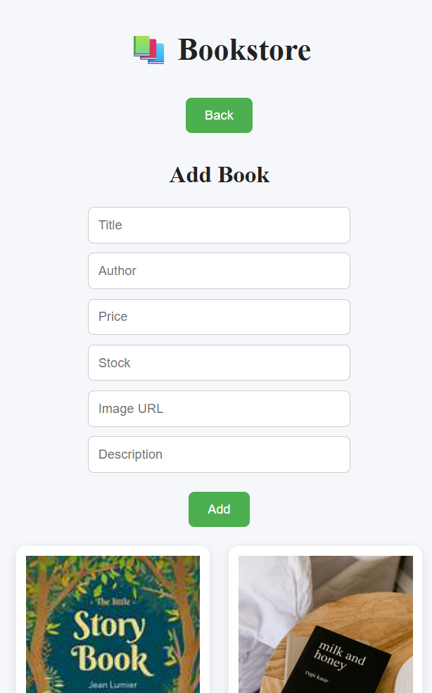
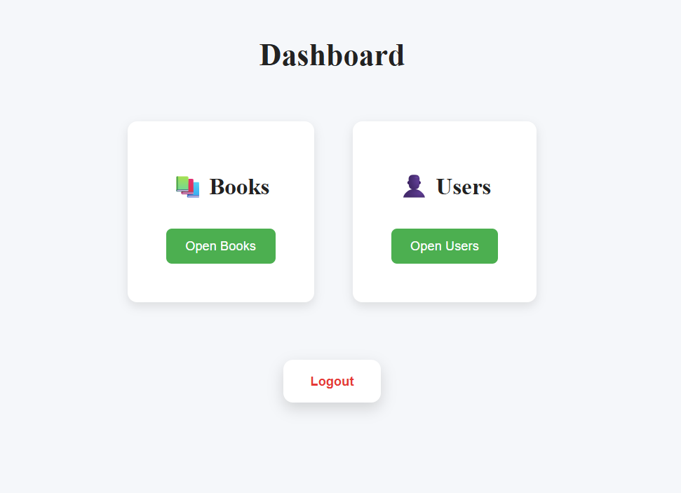
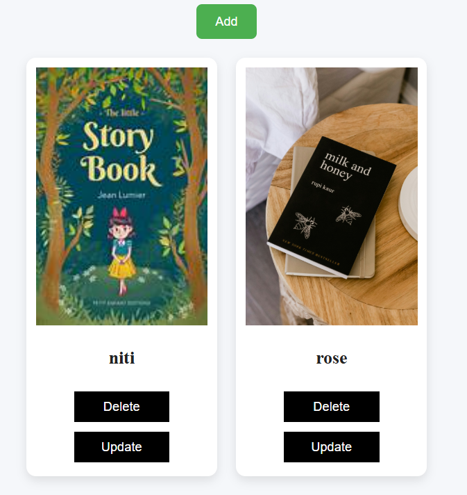
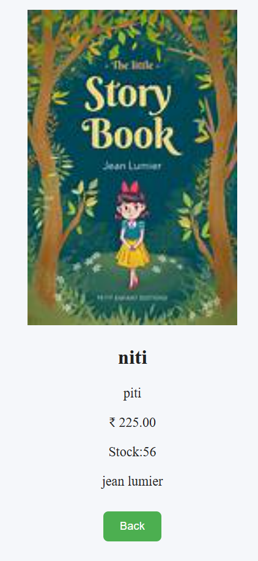
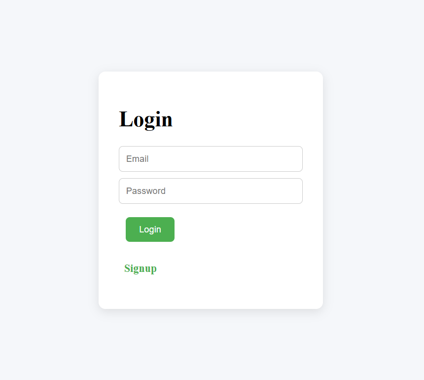
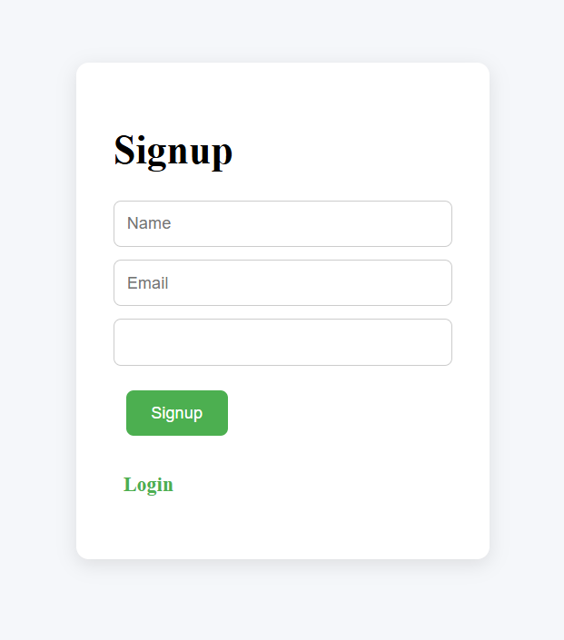
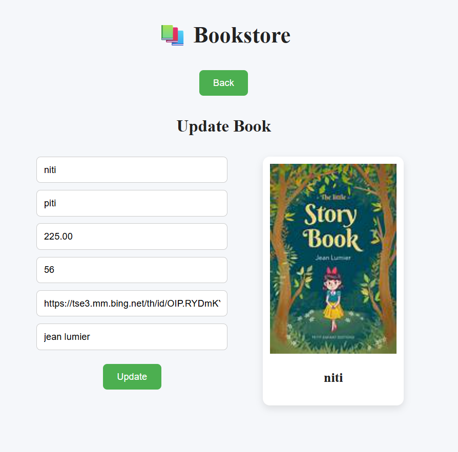
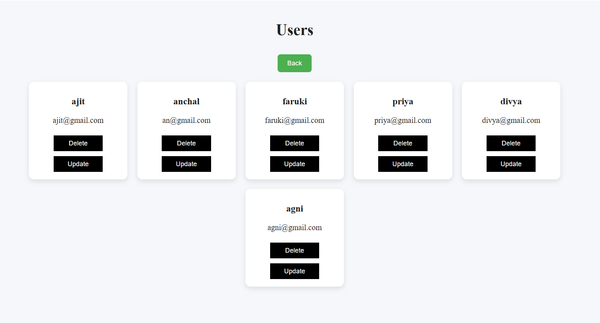

# 📚 Bookstore

This is a full-stack project combining a bookstore system with user management. Users can sign up, log in, view books, and manage their account. Admin-like functionality allows managing books and users with create, update, and delete operations.

The project uses React for the frontend, Node.js/Express for the backend, and MySQL for the database.

## Features

### User Features
- Sign up and log in with email & password
- View list of books
- View book details (title, author, price, stock, description)
- Update personal details (name, email)

### Admin / Management Features
- Add, update, delete books
- View list of users
- Update or delete user accounts
- Dashboard with separate sections for Books and Users

## Tech Stack
- Frontend: React, JSX, CSS-in-JS
- Backend: Node.js, Express
- Database: MySQL
- HTTP Client: Axios

## Project Structure
bookstore-app/
├─ backend/
│  ├─ controllers/
│  │  ├─ authController.js
│  │  └─ userController.js
│  ├─ db.js
│  ├─ routes/
│  └─ server.js
├─ frontend/
│  └─ src/
│     ├─ App.jsx
│     └─ index.js
└─ README.md

## Installation & Running Locally
1. Clone the repo:
git clone https://github.com/<your-username>/<repository-name>.git
cd <repository-folder>

2.Install backend dependencies:
cd backend
npm install

3.Install frontend dependencies:
cd ../frontend
npm install

4.Create a MySQL database and update the db.js file with your credentials.

5.Start the backend:
cd ../backend
npm start

6.Start the frontend:
cd ../frontend
npm start

7.Open your browser and navigate to http://localhost:3000.

#Screenshot of Project 

//bookstore page here you can add new book

 /n
//dashboard page here you can choose in which page you want to go user or bookstore

//delete_update page 

 
//description page details of book you want to see 

 
//Login page if you already have account you login here

//Signup page if you dont have account you first register the details here 

//Update book page here you can update the details 

 
// delete and update the user 

Built by Anchal Bisht
